# HHS CS Workshop: CNNs
Learn about Convolutional Neural Networks (CNNs).  
Most of the code is taken from this [Kaggle](https://www.kaggle.com/code/yogeshrampariya/mnist-classification-using-lenet-on-pytorch) by [Yogesh Rampariya](https://github.com/yogizhere10).  
[Workshop slides](https://github.com/BaroqueObama/hhs-ws-cnn/blob/main/GM9.pdf)   
Build a CNN model using Pytorch that classifies small images (either digits or clothing) into categories.  
## Code:
### Data
MNIST 28 by 28 pixel gray scale images.  
**Digits:** Hand-drawn digits from zero through nine. Taken from `torchvision.datasets.MNIST()`.  
**Fashion:** Images of fashion items from boots to shirts. Taken from `torchvision.datasets.FashionMNIST()`.  
The images are normalized and resized to 32 by 32 images for faster learning. Use `transforms.Compose()`.  

|              Index 0; Label 9              |                Index 5499; Label 1               | Index 9999; Label 6                              |
|:------------------------------------------:|:------------------------------------------------:|--------------------------------------------------|
| 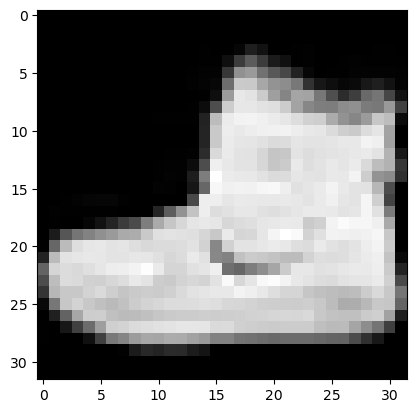 | 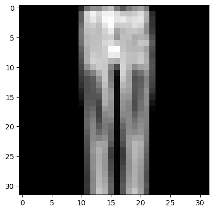 | 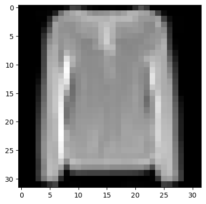 |  

### Train and Validation Split
80-20 split between training and validation data.  
Create data loaders for both training and validation with batch_size 512.  
|      First 110 images of training data      |     First 110 images of validation data     |
|:-------------------------------------------:|:-------------------------------------------:|
| 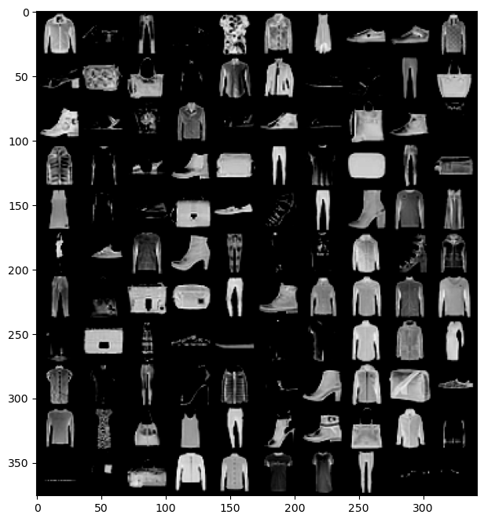 | 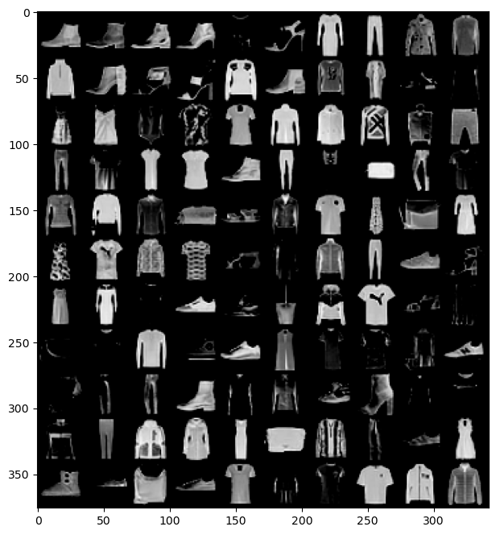 |  

### Build LeNet5 using Torch.nn
**Model:**  
```
LeNet5(
  (features): Sequential(
    (0): Conv2d(1, 6, kernel_size=(5, 5), stride=(1, 1))
    (1): Tanh()
    (2): AvgPool2d(kernel_size=2, stride=2, padding=0)
    (3): Conv2d(6, 16, kernel_size=(5, 5), stride=(1, 1))
    (4): Tanh()
    (5): AvgPool2d(kernel_size=2, stride=2, padding=0)
  )
  (classifier): Sequential(
    (0): Linear(in_features=400, out_features=120, bias=True)
    (1): Tanh()
    (2): Linear(in_features=120, out_features=84, bias=True)
    (3): Tanh()
    (4): Linear(in_features=84, out_features=10, bias=True)
  )
)
```  
**Activity:**  
Improve model by using **max-pooling** rather than avg-pooling and **ReLU** activation function rather than Tanh.  
### Test Model (Before Fitting)  
Test model on image index 0.
```
tensor([[0.1067, 0.1068, 0.1097, 0.0926, 0.1070, 0.0970, 0.1017, 0.0963, 0.0893, 0.0929]], grad_fn=<SoftmaxBackward0>)
```
Notice that the initial guess from the model gives each category a rough 10% confidence for each category. This is not very good but expected.  
### Device Selection  
Picks GPU if available, else CPU.  
### Fit/Train Model  
- `loss_batch`: Calculates loss on batch. 
- `evaluate`: Evaluates model based on validation dataset. 
- `fit`: Fits model to data for some number of epochs. 
- `accuracy`: Returns model accuracy. 
**Initial Model:**  
```
Initial Validation Losses: 2.3133945096333823, Accuracy: 0.05483333333333333
```  
**Run 25 Epochs:**  
```
Epoch 1/25, train_loss: 0.4861, val_loss: 0.5508, val_accuracy: 0.7899, train_accuracy: 0.8307
Epoch 5/25, train_loss: 0.3102, val_loss: 0.3462, val_accuracy: 0.8718, train_accuracy: 0.8828
Epoch 10/25, train_loss: 0.2958, val_loss: 0.3184, val_accuracy: 0.8858, train_accuracy: 0.8776
Epoch 15/25, train_loss: 0.2596, val_loss: 0.3037, val_accuracy: 0.8948, train_accuracy: 0.9062
Epoch 20/25, train_loss: 0.2033, val_loss: 0.2978, val_accuracy: 0.8990, train_accuracy: 0.9245
Epoch 25/25, train_loss: 0.1781, val_loss: 0.3203, val_accuracy: 0.8955, train_accuracy: 0.9219
```  
### Plot Results  
|                 Training and Validation Loss by Epoch                |                Training and Validation Accuracy by Epoch                |
|:--------------------------------------------------------------------:|:-----------------------------------------------------------------------:|
| 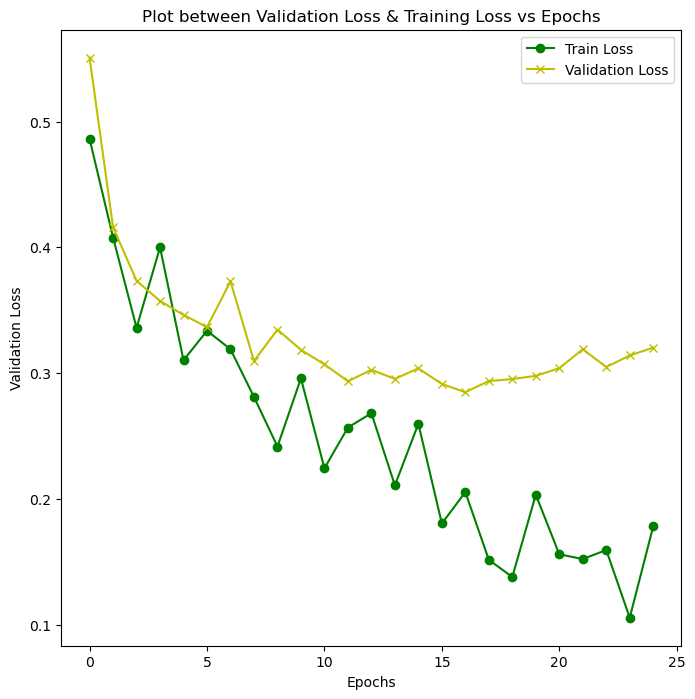 | 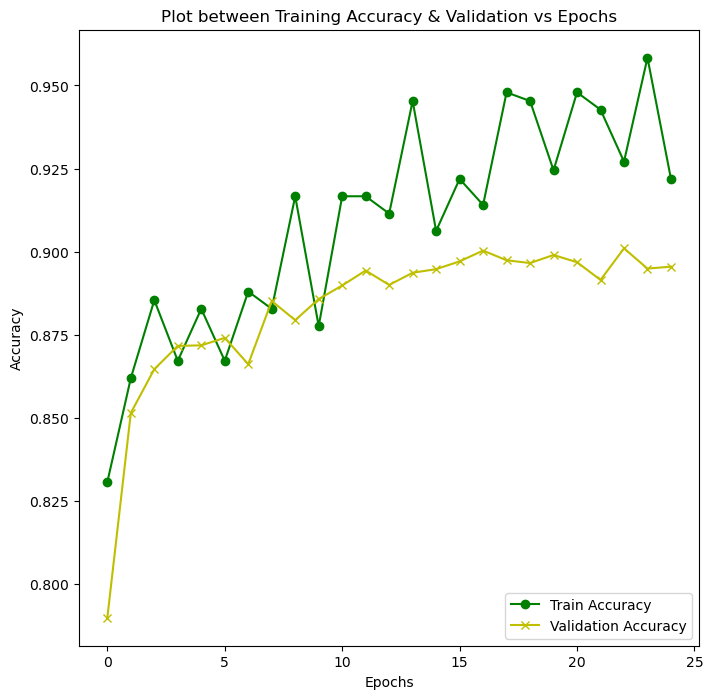 |  
### Model Evaluation  
**Overall Loss and Accuracy:**  
```
Total Losses: 0.34300837733745576, Accuracy: 89.33
```  

|              Label: 9, Predicted: 9              |              Label: 2, Predicted: 2              |              Label: 1, Predicted: 1              |              Label: 0, Predicted: 6              |
|:------------------------------------------------:|:------------------------------------------------:|:------------------------------------------------:|:------------------------------------------------:|
| 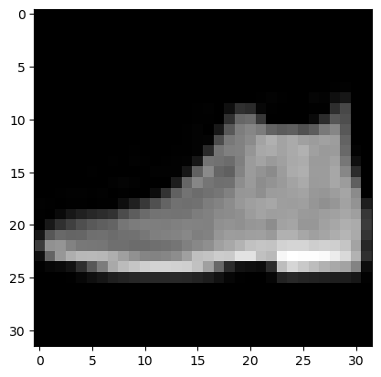 | 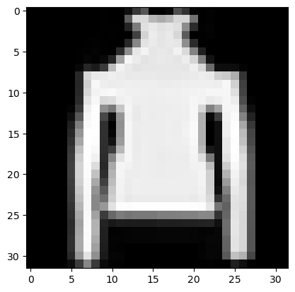 | 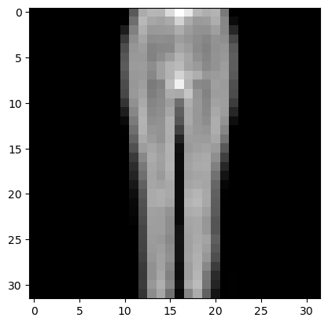 | 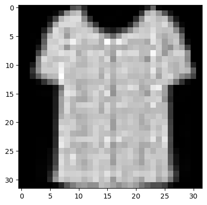 |  
### "Improved" Model  
Using **max-pooling** instead of avg-pooling and **ReLU** activation function instead of Tanh.  
```
LeNet5(
  (features): Sequential(
    (0): Conv2d(1, 6, kernel_size=(5, 5), stride=(1, 1))
    (1): ReLU()
    (2): MaxPool2d(kernel_size=2, stride=2, padding=0, dilation=1, ceil_mode=False)
    (3): Conv2d(6, 16, kernel_size=(5, 5), stride=(1, 1))
    (4): ReLU()
    (5): MaxPool2d(kernel_size=2, stride=2, padding=0, dilation=1, ceil_mode=False)
  )
  (classifier): Sequential(
    (0): Linear(in_features=400, out_features=120, bias=True)
    (1): ReLU()
    (2): Linear(in_features=120, out_features=84, bias=True)
    (3): ReLU()
    (4): Linear(in_features=84, out_features=10, bias=True)
  )
)
```  
**Training 25 Epochs** (Seems to overfit):  
```
Epoch 1/25, train_loss: 0.4675, val_loss: 0.5533, val_accuracy: 0.7854, train_accuracy: 0.7995
Epoch 5/25, train_loss: 0.3502, val_loss: 0.3192, val_accuracy: 0.8824, train_accuracy: 0.8568
Epoch 10/25, train_loss: 0.2386, val_loss: 0.2980, val_accuracy: 0.8938, train_accuracy: 0.9193
Epoch 15/25, train_loss: 0.2561, val_loss: 0.3113, val_accuracy: 0.8906, train_accuracy: 0.8958
Epoch 20/25, train_loss: 0.1303, val_loss: 0.3209, val_accuracy: 0.9008, train_accuracy: 0.9505
Epoch 25/25, train_loss: 0.1960, val_loss: 0.3553, val_accuracy: 0.8971, train_accuracy: 0.9323
```  
|                 Training and Validation Loss by Epoch                |                Training and Validation Accuracy by Epoch                |
|:--------------------------------------------------------------------:|:-----------------------------------------------------------------------:|
| 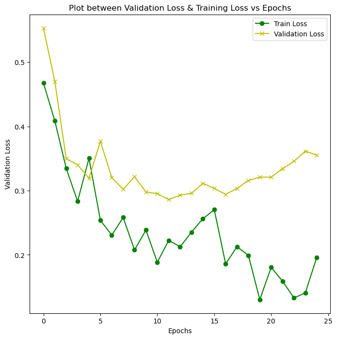 | 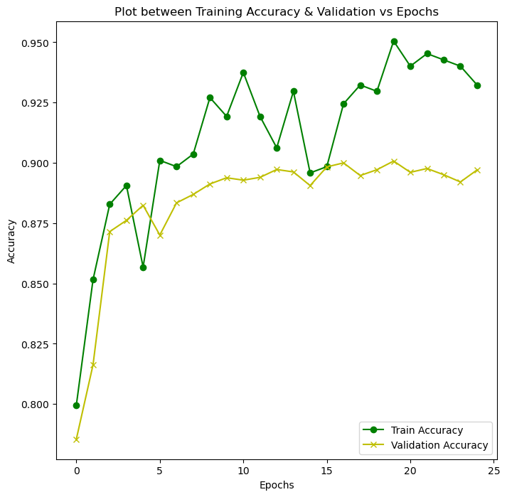 |

**Overall Loss and Accuracy:**  
```
Total Losses: 0.35930486946105955, Accuracy: 89.36
```  